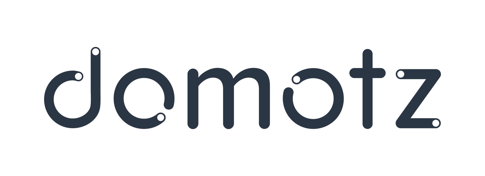

<!-- [![Contributors][contributors-shield]][contributors-url]
[![Forks][forks-shield]][forks-url]
[![Stargazers][stars-shield]][stars-url]
[![Issues][issues-shield]][issues-url]
[![MIT License][license-shield]][license-url]
[![LinkedIn][linkedin-shield]][linkedin-url] -->


<!-- PROJECT LOGO -->
<br />
<p align="center">
  <a href="https://github.com/twokyum/MonIT.git">
    
  </a>
  <a href="https://github.com/twokyum/MonIT.git">
    
  </a>

  <h1 align="center">System Monitoring Setup Guideline</h3>

  <p align="center">
    <h2 align="center">Network Monitoring with SNMP <br/> & <br/> CT/AC/Temperature Real-Time Monitoring</h2>  
    <!-- <a href="https://github.com/github_username/repo"><strong>Explore the docs »</strong></a>
    <br />
    <br />
    <a href="https://github.com/github_username/repo">View Demo</a>
    ·
    <a href="https://github.com/github_username/repo/issues">Report Bug</a>
    ·
    <a href="https://github.com/github_username/repo/issues">Request Feature</a> -->
  </p>
</p>


<!-- TABLE OF CONTENTS -->
## Table of Contents

* [About the Project](#about-the-project)
  * [Built With](#built-with)
* [Getting Started](#getting-started)
  * [Prerequisites](#prerequisites)
  * [Installation](#installation)
* [Usage](#usage)
* [Roadmap](#roadmap)
* [Contributing](#contributing)
* [License](#license)
* [Contact](#contact)
* [Acknowledgements](#acknowledgements)


<!-- ABOUT THE PROJECT -->
## About The Project
[SCT013_IMG]: images/SCT013_IMG.jfif
[PRICT7V1_IMG]: images/RPICT7V1_IMG.jfif
[RPICT3T1_IMG]: images/RPICT3T1_IMG.jpg

This project is your guideline for real-time system monitoring setup. 
Here's a blank template to get started:
<!-- **To avoid retyping too much info. Do a search and replace with your text editor for the following:** -->


### Built With

* [![RPICT7V1 Module][PRICT7V1_IMG]](http://lechacalshop.com/gb/internetofthing/22-raspberrypi-7x-current-sensor-adaptor-1-voltage-emoncms.html) RPICT7V1 - 7 Current Sensor & 1 AC Sensor 
* [![RPICT3T1 Module][RPICT3T1_IMG]](http://lechacalshop.com/gb/internetofthing/22-raspberrypi-7x-current-sensor-adaptor-1-voltage-emoncms.html) RPICT3T1 - 3 Current Sensor & 1 Temperature Sensor 
* [![Current Sensor][SCT013_IMG]](http://lechacalshop.com/gb/internetofthing/16-sct-013-000-with-quality-jack-connector-emoncms-emonwrt.html) SCT013 - Current Sensor 


<!-- GETTING STARTED -->
## Getting Started

To get a local copy up and running follow these simple steps.

### Prerequisites

This is an example of how to list things you need to use the software and how to install them.
* npm
```sh
npm install npm@latest -g
```

### Installation
 
1. Clone the repo
```sh
git clone https://github.com/github_username/repo.git
```
2. Install NPM packages
```sh
npm install
```


<!-- USAGE EXAMPLES -->
## Usage

Use this space to show useful examples of how a project can be used. Additional screenshots, code examples and demos work well in this space. You may also link to more resources.

_For more examples, please refer to the [Documentation](https://example.com)_


<!-- ROADMAP -->
## Roadmap

See the [open issues](https://github.com/github_username/repo/issues) for a list of proposed features (and known issues).


<!-- CONTRIBUTING -->
## Contributing

Contributions are what make the open source community such an amazing place to be learn, inspire, and create. Any contributions you make are **greatly appreciated**.

1. Fork the Project
2. Create your Feature Branch (`git checkout -b feature/AmazingFeature`)
3. Commit your Changes (`git commit -m 'Add some AmazingFeature'`)
4. Push to the Branch (`git push origin feature/AmazingFeature`)
5. Open a Pull Request


<!-- LICENSE -->
## License

Distributed under the MIT License. See `LICENSE` for more information.


<!-- CONTACT -->
## Contact

Your Name - [@twitter_handle](https://twitter.com/twitter_handle) - email

Project Link: [https://github.com/github_username/repo](https://github.com/github_username/repo)


<!-- ACKNOWLEDGEMENTS -->
## Acknowledgements

* []()
* []()
* []()


<!-- MARKDOWN LINKS & IMAGES -->
<!-- https://www.markdownguide.org/basic-syntax/#reference-style-links -->
[contributors-shield]: https://img.shields.io/github/contributors/othneildrew/Best-README-Template.svg?style=flat-square
[contributors-url]: https://github.com/othneildrew/Best-README-Template/graphs/contributors
[forks-shield]: https://img.shields.io/github/forks/othneildrew/Best-README-Template.svg?style=flat-square
[forks-url]: https://github.com/othneildrew/Best-README-Template/network/members
[stars-shield]: https://img.shields.io/github/stars/othneildrew/Best-README-Template.svg?style=flat-square
[stars-url]: https://github.com/othneildrew/Best-README-Template/stargazers
[issues-shield]: https://img.shields.io/github/issues/othneildrew/Best-README-Template.svg?style=flat-square
[issues-url]: https://github.com/othneildrew/Best-README-Template/issues
[license-shield]: https://img.shields.io/github/license/othneildrew/Best-README-Template.svg?style=flat-square
[license-url]: https://github.com/othneildrew/Best-README-Template/blob/master/LICENSE.txt
[linkedin-shield]: https://img.shields.io/badge/-LinkedIn-black.svg?style=flat-square&logo=linkedin&colorB=555
[linkedin-url]: https://linkedin.com/in/othneildrew
[product-screenshot]: images/screenshot.png
[SCT013-IMG]: images/SCT013_IMG.jfif
[PRICT7V1_IMG]: images/RPICT7V1_IMG.jfif
[RPICT3T1_IMG]: images/RPICT3T1_IMG.jpg